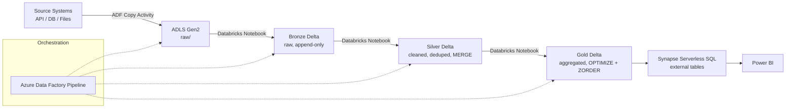

# Azure Databricks Lakehouse Pipeline

A Bronze/Silver/Gold lakehouse pipeline on Azure — ADF orchestrates ingestion into ADLS Gen2, Databricks (PySpark) transforms it through the medallion layers with Delta Lake, and Synapse Serverless SQL exposes Gold tables for Power BI reporting.

Built on the same Azure stack (ADF, Databricks, Delta Lake) used for HDFC Digital Banking and Microsoft Bing Analytics work.

---

## Architecture



**Medallion layers:**
- **Bronze** — raw data landed exactly as received from ADLS, append-only. Source of truth for replay.
- **Silver** — cleaned, deduplicated, conformed types, incrementally merged — the layer where business rules and data quality live.
- **Gold** — aggregated, reporting-ready tables. Optimized with `OPTIMIZE ... ZORDER` for fast Power BI/Synapse queries.

---

## Tech Stack

Azure Data Factory · Azure Databricks (PySpark) · Delta Lake · Azure Data Lake Storage Gen2 · Azure Synapse Analytics (Serverless SQL) · Power BI · GitHub Actions (CI)

---

## Repo Structure

```
azure-databricks-lakehouse/
├── adf/
│   └── pipeline_definition.json     # ADF pipeline: Copy Activity + Databricks Notebook Activities
├── notebooks/
│   ├── 01_bronze_ingestion.py       # Raw -> Bronze Delta
│   ├── 02_silver_transformation.py  # Bronze -> Silver Delta (incremental MERGE)
│   └── 03_gold_aggregation.py       # Silver -> Gold Delta (OPTIMIZE + ZORDER)
├── sql/
│   └── synapse_external_tables.sql  # Synapse Serverless SQL external tables over Gold
├── tests/
│   └── test_transformations.py
├── .github/workflows/ci.yml
└── docs/
    └── interview_talking_points.md
```

---

## How It Works

### 1. Ingestion (ADF → ADLS Gen2 → Bronze)
ADF's Copy Activity lands raw files into `adls://raw/`. `01_bronze_ingestion.py` reads them into a Bronze Delta table, append-only, with `mergeSchema` enabled for schema drift tolerance.

> **Enhancement noted, not implemented here:** in a live Databricks workspace this ingestion step is a good candidate for **Auto Loader** (`cloudFiles` format) instead of a batch read — it incrementally and efficiently discovers new files in ADLS without re-listing the whole directory each run. This repo uses a batch read for portability outside a Databricks cluster; swapping in Auto Loader is a one-line format change (`.format("cloudFiles")`) noted in the notebook.

### 2. Silver: incremental MERGE (`02_silver_transformation.py`)
Rather than reprocessing all of Bronze every run, this reads only records with `modified_ts` newer than Silver's last watermark, deduplicates, validates, and `MERGE`s into Silver — keeping the job fast as Bronze grows.

### 3. Gold: aggregation + performance tuning (`03_gold_aggregation.py`)
Builds reporting aggregates from Silver, then runs:
```sql
OPTIMIZE gold.sales_summary ZORDER BY (region, sale_date)
```
`OPTIMIZE` compacts small files from incremental writes; `ZORDER` co-locates related data so filtered queries (by region/date, the common Power BI filter pattern) skip far more data.

### 4. Serving (Synapse Serverless SQL → Power BI)
`sql/synapse_external_tables.sql` creates external tables over the Gold Delta files so Synapse Serverless SQL — and Power BI via DirectQuery — can query them without duplicating data into a warehouse.

---

## Running Locally

```bash
pip install -r requirements.txt

# Run each layer in order (uses local Delta tables under delta/ for portability)
python notebooks/01_bronze_ingestion.py
python notebooks/02_silver_transformation.py
python notebooks/03_gold_aggregation.py

# Unit tests
pytest tests/
```

---

## Design Decisions

- **Medallion architecture (Bronze/Silver/Gold)** — isolates raw ingestion from business logic from reporting, so a bad transformation never corrupts the source of truth, and each layer can be reprocessed independently.
- **Incremental processing via watermark + MERGE** — avoids full-table reprocessing as data volume grows; this is the difference between a pipeline that scales and one that gets slower every month.
- **OPTIMIZE + ZORDER on Gold** — directly targets Power BI query latency, which is what stakeholders actually notice; compaction also controls storage cost from the small-file problem streaming/incremental writes create.
- **Synapse Serverless over a dedicated pool** — no infrastructure to provision or pay for when idle; appropriate when Gold tables are already pre-aggregated and query volume doesn't justify a dedicated pool's cost.

See [`docs/interview_talking_points.md`](docs/interview_talking_points.md) for how to talk through this project's trade-offs in an interview.
